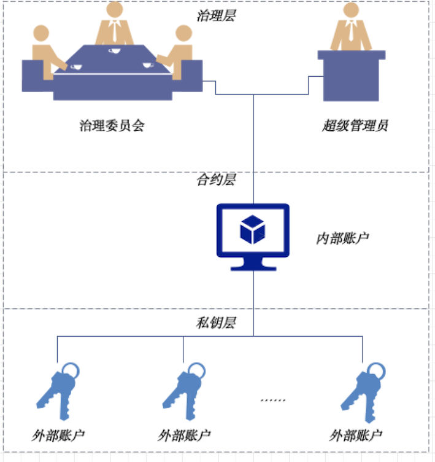
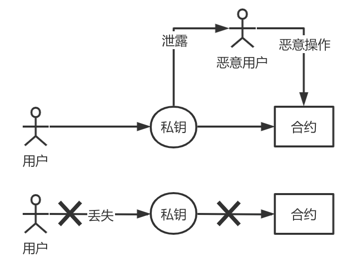
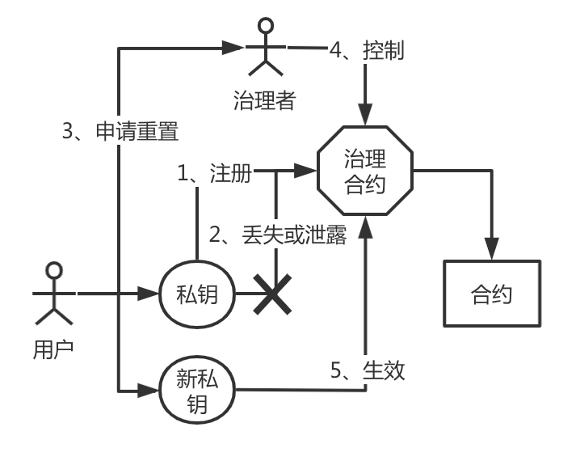
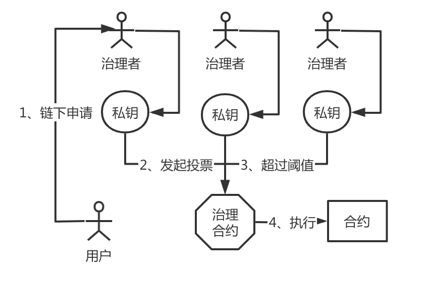
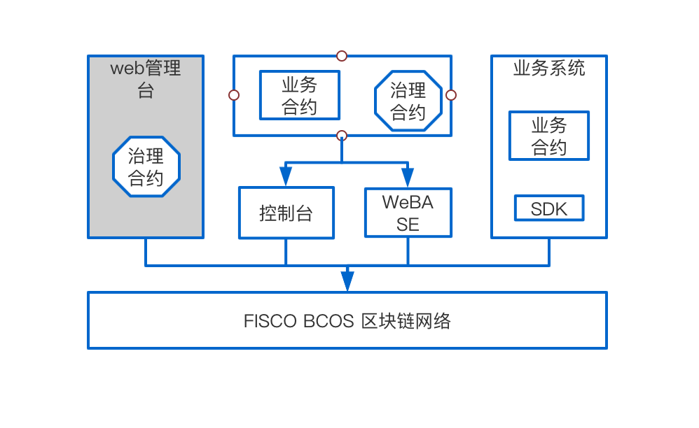

# 组件介绍

## 术语定义
<br />下图为账户治理各主体概念之间的联系：<br />



区块链和区块链治理的相关术语可参考： 《[术语定义](term_def.md)》

## 背景


### 为什么需要引入账户治理？

<br />在现有的区块链网络中，是以私钥为控制的中心进行设计的： 每个区块链的参与者首先创建一个私钥，通过这个私钥生成公钥并进一步生成外部账户；随后，参与者使用这个私钥对发起的交易报文进行签名并上链。参与者之间也可以通过外部账户的地址来识别和标识身份，完成相关的业务交互。可以说，这个私钥至关重要，一旦泄露或丢失，后果极为严重：<br />

- 泄露以后，盗窃者可以任意控制该外部账户下所有的合约，发送任意的交易指令。
- 丢失以后，原有的用户会失去对该外部账户下所有的合约的控制，无法发送任何的交易指令。


### 账户治理机制是如何解决上述痛点的？

<br />为了解决此问题，需要引入一种账户治理的机制，将原有的账户控制以私钥为中心，改为以普通账户为中心。当用户发现泄露私钥后，可以自助发起重置普通账户所关联映射的私钥。当用户发现丢失私钥后，可以通过向账户治理委员会发起重置申请，更换私钥。而且，当用户更换私钥后，普通账户的地址始终不变，保证了业务平滑运行。<br />
<br /> <br />
<br />除了解决这个核心痛点外，账户治理体系还额外引入了注册、冻结、解冻、销户等概念，使得在一个分布式协作的业务模式中，账户相关的操作形成了闭环和自洽的治理逻辑。这样，当一个基于区块链的业务系统涉及到链上的账户体系时，可以快速借助账户治理组件的功能，快速、灵活得实现账户体系的治理。<br />

### 治理者应该如何进行账户治理？

<br />在传统的中心化的解决方案中，存在一个超级管理员的角色，典型的如传统关系型数据库中的root超级管理员，拥有所有的权限。为了兼容这种需求，我们提供了超级管理员的账户治理模式。<br />
<br />但是，传统的中心化解决方案中，存在着权限独大、易被操纵、不利制衡的缺陷，无法满足日益蓬勃的多机构、分布式协作商业模式下的发展。如果链的运营是由一组对等的机构采用分布式协作的方式来管理，则推荐采用治理委员会模式。<br />
<br />治理委员会模式下的治理者通常是参与链的多方共同选出的一个委员会，由多个机构共同进行管理和决策。治理账户维护了一组投票帐号和每个账户对应的投票权重，投票通过的阈值。当某个操作的投票数量超过阈值时，才允许执行该操作。无论是平权还是不同权重，借助这种灵活的投票机制，可以满足大部分复杂场景的治理需求。<br />
<br />
## 概览

<br />为了解决上述痛点，同时践行分布式商业的理念，WeBankBlockchain-Gov-Acct应运而生。<br />
<br />WeBankBlockchain-Gov-Acct是一套开源的区块链账户治理的中间件解决方案，提供了多种区块链账户治理模式、账户生命周期管理、用户自主管理区块链账户治理相关的整体解决方案，提供了包括治理账户创建、多种治理模式选择、治理权限授权，账户创建、冻结、解冻、更换私钥、销户等账户生命周期的各类账户管理功能。<br />

### 关键特性
<br />WeBankBlockchain-Gov-Acct定位为区块链账户治理中间件，旨在充分合理地在区块链节点网络中，利用智能合约所提供的图灵完备的计算能力，提供自洽的账户治理能力。<br />

- **支持多种治理方式**
- **去中心化的分布式协作治理思想**
- **账户全生命周期的治理**
- **全面、灵活的集成方式**
- **支持可插拔的设计，对业务侵入小**
- **支持国密**
- **支持社交好友重置私钥**


### 组成部分
<br />WeBankBlockchain-Gov-Acct包含了以下组成部分：<br />

- **合约代码**，最核心的账户治理实现部分。当前版本提供了基于Solidity语言实现，完全适配FISCO BCOS。 理论上可在任何支持了EVM虚拟机的区块链系统上运行。
- **Java SDK**。适配了合约代码。通过集成Java SDK以后，可以适配和调用账户治理的所有合约接口。此外，进一步对使用接口进行简化和封装，可符合Java程序员的使用习惯。
- **合约集成Demo**。提供了基于存证和积分转账场景的两个demo。（详情可参考合约中samples目录）
- **SDK集成Demo**。以Weledger项目为例，展示了如何使用Java SDK。（详情可参考Weleder项目）
- **TDD测试代码**。包含了全套的合约测试代码，轻松支持CI/CD。(详情可参考Java SDK中src/test/java目录下的代码)
- **web管理台**  直接通过可视化页面来进行操作，正在开发中……

<br />使用者基于自身业务的实际场景来自由、灵活地使用和集成。<br />

### 集成方式

<br />在FISCO BCOS生态中，WeBankBlockchain-Gov-Acct提供了以下使用和集成的方式：<br />

- 通过门面部署合约来发布合约到链上，获得账户治理的能力；
- 通过在自身业务的合约中引入或集成账户治理合约；
- 通过SDK引入Jar包，集成到自己的Java项目中来调用提供的接口；
- 通过web管理台和后端的Restful API接口，来发布和执行账户管理功能（开发中……）



### 核心功能列表


#### 治理者账户相关核心功能


- 重置用户私钥
- 冻结普通账户
- 解冻普通账户
- 注销普通账户
- 移交管理员权限（超级管理员模式下）
- 添加或修改一个治理委员会的投票账户（治理委员会模式下）
- 删除一个治理委员会的投票账户（治理委员会模式下）
- 设置投票阈值 （治理委员会模式下）


#### 普通账户相关核心功能


- 创建一个新账户
- 重置用户私钥
- 注销账户
- 添加社交好友来支持重置账户私钥
- 添加或删除关联的社交好友
- 查询普通账户状态
- 查询外部账户是否已注册


<br />更多详细的功能描述请参考《设计文档》。<br />

### 业务流程介绍


1. 确定治理方式，确定是采用超级管理员模式还是治理委员会模式。所有的治理者需准备和生成机构的私钥。
2. 部署治理合约。根据步骤1确定的治理方式，发布对应的治理合约。
3. 用户普通账户开户。用户预先准备好自己的私钥，通过调用步骤2所部署的治理合约所生成的控制合约来开户。
4. 普通账户地址、状态查询。通过调用步骤2所部署的治理合约所生成的控制合约来查询用户地址和状态。
5. 账户治理常规操作。治理者可发起和操作普通账户。包括了冻结、解冻、销户、重置私钥等普通账户类操作，以及修改投票阈值，修改成员投票权重、修改治理成员等治理账户类的操作。
6. 普通账户自助操作。普通账户可发起重置私钥，设置账户管理模式，添加关联社交好友普通账户等操作。
7. 普通账户销户。普通账户销户完成后，该账户生命周期终结。


## 快速开始

阅读[快速开始](docs/quick_start.md)，来获取最简单的WeBankBlockchain-Gov-Acct的快速入门。

## 组件使用demo
### 合约集成demo

#### 存证demo

存证合约的demo
```
pragma solidity ^0.4.25;

import "./AccountManager.sol";

contract EvidenceDemo {
    struct EvidenceData {
        string hash;
        address owner;
        uint256 timestamp;
    }
    address public _owner;
    mapping(string => EvidenceData) private _evidences;
    // import AccountManager
    AccountManager _accountManager;

    constructor(address accountManager) public {
        // import accountManager
        _accountManager = AccountManager(accountManager);
        // set user account instead of external account
        _owner = _accountManager.getAccount(msg.sender);
        require(_owner != 0x0, "Invalid account!");
    }

    modifier onlyOwner() {
        // get user account by external account
        address userAccountAddress = _accountManager.getAccount(msg.sender);
        require(userAccountAddress == _owner, "Not admin");
        _;
    }

    function setData(
        string hash,
        address owner,
        uint256 timestamp
    ) public onlyOwner {
        _evidences[hash].hash = hash;
        _evidences[hash].owner = owner;
        _evidences[hash].timestamp = timestamp;
    }

    function getData(string hash)
        public
        view
        returns (
            string,
            address,
            uint256
        )
    {
        EvidenceData storage evidence = _evidences[hash];
        return (evidence.hash, evidence.owner, evidence.timestamp);
    }
}

```


存证合约的demo在控制台的部署指令

```
=============================================================================================
Welcome to FISCO BCOS console(1.0.9)!
Type 'help' or 'h' for help. Type 'quit' or 'q' to quit console.
 ________ ______  ______   ______   ______       _______   ______   ______   ______
|        |      \/      \ /      \ /      \     |       \ /      \ /      \ /      \
| $$$$$$$$\$$$$$|  $$$$$$|  $$$$$$|  $$$$$$\    | $$$$$$$|  $$$$$$|  $$$$$$|  $$$$$$\
| $$__     | $$ | $$___\$| $$   \$| $$  | $$    | $$__/ $| $$   \$| $$  | $| $$___\$$
| $$  \    | $$  \$$    \| $$     | $$  | $$    | $$    $| $$     | $$  | $$\$$    \
| $$$$$    | $$  _\$$$$$$| $$   __| $$  | $$    | $$$$$$$| $$   __| $$  | $$_\$$$$$$\
| $$      _| $$_|  \__| $| $$__/  | $$__/ $$    | $$__/ $| $$__/  | $$__/ $|  \__| $$
| $$     |   $$ \\$$    $$\$$    $$\$$    $$    | $$    $$\$$    $$\$$    $$\$$    $$
 \$$      \$$$$$$ \$$$$$$  \$$$$$$  \$$$$$$      \$$$$$$$  \$$$$$$  \$$$$$$  \$$$$$$

=============================================================================================
[group:1]> deploy EvidenceDemo "0x08ba44f04df9671a2fc298756bc06f1dbca56e11"
revert instruction

[group:1]> deploy AdminGovernBuilder
contract address: 0xc00504c8dad8f75d08ebceda4f7c7b1d13b327d5

[group:1]> call AdminGovernBuilder 0xc00504c8dad8f75d08ebceda4f7c7b1d13b327d5 _governance
0x24c327f0bf851a936c5049b019142709067b711d

[group:1]> call WEGovernance 0x24c327f0bf851a936c5049b019142709067b711d getAccountManager
0x6e869333a1e3dc83501723b7dcb624b09c1757e3

[group:1]>  deploy EvidenceDemo "0x6e869333a1e3dc83501723b7dcb624b09c1757e3"
contract address: 0x99276281a782a199d1998ce7a56927d99dcd6c6a

[group:1]> call EvidenceDemo 0x99276281a782a199d1998ce7a56927d99dcd6c6a setData "hash" "0x6e869333a1e3dc83501723b7dcb624b09c1757e3" 1
transaction hash: 0xc7f2531ca9e968a97a6035a4fbfa79f2a0cda7adfb4b9f878e36e4a879fa5249

[group:1]> call EvidenceDemo 0x99276281a782a199d1998ce7a56927d99dcd6c6a getData "hash"
[hash, 0x6e869333a1e3dc83501723b7dcb624b09c1757e3, 1]

```

#### 转账demo

转账合约的demo

```
pragma solidity ^0.4.25;


library LibSafeMath {   
    function sub(uint256 a, uint256 b) internal pure returns (uint256) {
        require(b <= a, "SafeMath: subtraction overflow");
        uint256 c = a - b;

        return c;
    }
    function add(uint256 a, uint256 b) internal pure returns (uint256) {
        uint256 c = a + b;
        require(c >= a, "SafeMath: addition overflow");

        return c;
    }
}


pragma solidity ^0.4.25;

import "./LibSafeMath.sol";
import "./AccountManager.sol";


contract TransferDemo {
    using LibSafeMath for uint256;
    mapping(address => uint256) private _balances;
    // import AccountManager
    AccountManager _accountManager;

    constructor(address accountManager, uint256 initBalance) public {
        // import accountManager
        _accountManager = AccountManager(accountManager);
        address owner = _accountManager.getAccount(msg.sender);
        _balances[owner] = initBalance;
    }

    modifier validateAccount(address addr) {
        require(
            // predicate account status
            _accountManager.isExternalAccountNormal(addr),
            "Account is abnormal!"
        );
        _;
    }

    modifier checkTargetAccount(address sender) {
        require(
            msg.sender != sender && sender != address(0),
            "Can't transfer to illegal address!"
        );
        _;
    }

    function balance(address owner) public view returns (uint256) {
        // 1.get account by external account, 2.get balace by account.
        return _balances[_accountManager.getAccount(owner)];
    }

    function transfer(address toAddress, uint256 value)
        public
        // validate source & target account
        validateAccount(msg.sender)
        validateAccount(toAddress)
        checkTargetAccount(toAddress)
        returns (bool)
    {
        // 1. get source account
        address fromAccount = _accountManager.getAccount(msg.sender);
        // 2. sub the balance of source account
        uint256 balanceOfFrom = _balances[fromAccount].sub(value);
        // 3. modify the balance of source account
        _balances[fromAccount] = balanceOfFrom;
        // 4. get target account
        address toAccount = _accountManager.getAccount(toAddress);
        // 5. add balance of target account
        uint256 balanceOfTo = _balances[toAccount].add(value);
        // set the new balance of target account
        _balances[toAccount] = balanceOfTo;
        return true;
    }
}

```

转账合约的demo在控制台的部署指令

```
=============================================================================================
Welcome to FISCO BCOS console(1.0.9)!
Type 'help' or 'h' for help. Type 'quit' or 'q' to quit console.
 ________ ______  ______   ______   ______       _______   ______   ______   ______
|        |      \/      \ /      \ /      \     |       \ /      \ /      \ /      \
| $$$$$$$$\$$$$$|  $$$$$$|  $$$$$$|  $$$$$$\    | $$$$$$$|  $$$$$$|  $$$$$$|  $$$$$$\
| $$__     | $$ | $$___\$| $$   \$| $$  | $$    | $$__/ $| $$   \$| $$  | $| $$___\$$
| $$  \    | $$  \$$    \| $$     | $$  | $$    | $$    $| $$     | $$  | $$\$$    \
| $$$$$    | $$  _\$$$$$$| $$   __| $$  | $$    | $$$$$$$| $$   __| $$  | $$_\$$$$$$\
| $$      _| $$_|  \__| $| $$__/  | $$__/ $$    | $$__/ $| $$__/  | $$__/ $|  \__| $$
| $$     |   $$ \\$$    $$\$$    $$\$$    $$    | $$    $$\$$    $$\$$    $$\$$    $$
 \$$      \$$$$$$ \$$$$$$  \$$$$$$  \$$$$$$      \$$$$$$$  \$$$$$$  \$$$$$$  \$$$$$$

=============================================================================================
[group:1]> deploy AdminGovernBuilder
contract address: 0xd17a5cdcb5e4b1cc3ce67c71c8e0e1dd07f33914

[group:1]> call AdminGovernBuilder 0xd17a5cdcb5e4b1cc3ce67c71c8e0e1dd07f33914 _governance
0xda80ff2d1cd498c86439cf52c1b1a8bb01da6fbc

[group:1]> call WEGovernance 0xda80ff2d1cd498c86439cf52c1b1a8bb01da6fbc getAccountManager
0x199a2b9f43415f1f5ca9da6dc7c3dc124c531fd5

[group:1]> deploy TransferDemo "0x199a2b9f43415f1f5ca9da6dc7c3dc124c531fd5" 1000
contract address: 0x7873756b7a93afed89482040257d332e3fc72336

[group:1]> call TransferDemo 0x7873756b7a93afed89482040257d332e3fc72336 transfer "0x1" 1
The execution of the contract rolled back.

[group:1]> call AccountManager 0x199a2b9f43415f1f5ca9da6dc7c3dc124c531fd5 newAccount "0x1"
transaction hash: 0xf5a806396256e01295d014edf5688afdc0e7c1f4363c47f5bd083a14f1398192
---------------------------------------------------------------------------------------------
Output
function: newAccount(address)
return type: (bool, address)
return value: (true, 0x941d587493454784874e7d463dc76368f20bd3ff)
---------------------------------------------------------------------------------------------
Event logs
event signature: LogSetOwner(address,address) index: 0
event value: (0x0000000000000000000000000000000000000001, 0x941d587493454784874e7d463dc76368f20bd3ff)
event signature: LogManageNewAccount(address,address,address) index: 0
event value: (0x0000000000000000000000000000000000000001, 0x941d587493454784874e7d463dc76368f20bd3ff, 0x199a2b9f43415f1f5ca9da6dc7c3dc124c531fd5)
---------------------------------------------------------------------------------------------

[group:1]> call TransferDemo 0x7873756b7a93afed89482040257d332e3fc72336 transfer "0x1" 1
transaction hash: 0xdbe329df31c18fd54b87139045db1fe2d0358c54139f1b2b649fb730c9a33420
---------------------------------------------------------------------------------------------
Output
function: transfer(address,uint256)
return type: (bool)
return value: (true)
---------------------------------------------------------------------------------------------

[group:1]> call TransferDemo 0x7873756b7a93afed89482040257d332e3fc72336 balance "0x1"
1

[group:1]>

```
### SDK集成Demo

Weledger项目完整集成了WeBankBlockchain-Gov-Acct的Java SDK，相关的用法详情可参考Weledger项目的文档和代码。

## 测试代码说明

### CI/CD测试代码

#### 链配置

打开src/main/application.properties，修改链配置信息。

```
## 机构ID
system.orgId=org1
## 链的ip端口，多个节点使用;分隔
system.nodeStr=[ip]:[channel_port]
## 群组ID
system.groupId=1
```

#### 自动运行

```
./gradlew test
```
<br />可查看自动化测试的运行结果报告。<br />


## Java SDK 详细功能API使用说明

详细的API使用说明可参考《[API使用说明](api.md)》

