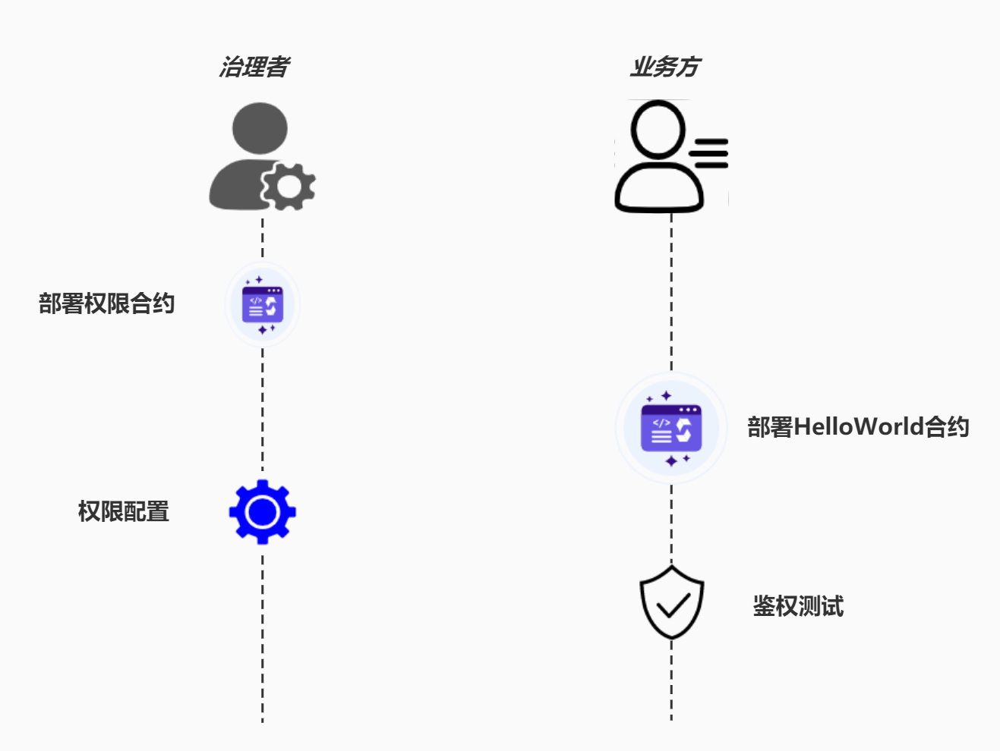

# 快速开始

## 1. 前置依赖

| 依赖软件   | 说明                                                         | 备注 |
| ---------- | ------------------------------------------------------------ | ---- |
| FISCO-BCOS       | >= 2.0 |      |
| Java       | \>= JDK[1.8]                                                 |      |
| Git        | 下载的安装包使用Git                                          |      |

- Java版本<br />JDK1.8 或者以上版本，推荐使用OracleJDK。<br />**注意**：CentOS的yum仓库的OpenJDK缺少JCE(Java Cryptography Extension)，会导致JavaSDK无法正常连接区块链节点。
   - Java安装<br />参考 [Java环境配置](https://fisco-bcos-documentation.readthedocs.io/zh_CN/latest/docs/manual/console.html#java)
   - FISCO BCOS区块链环境搭建<br />参考 [FISCO BCOS安装教程](https://fisco-bcos-documentation.readthedocs.io/zh_CN/latest/docs/installation.html)
- 网络连通性<br />检查Web3SDK连接的FISCO BCOS节点`channel_listen_port`是否能telnet通，若telnet不通，需要检查网络连通性和安全策略。

## 2. 快速开始
权限组件的使用者包括两个角色：治理方和业务方。治理方负责权限合约的部署、配置；业务方负责接入权限合约、拦截非法调用。这一节提供一个简单但完整的示例，通过部署并为业务合约HelloWorld配置权限，以使您了解整个组件的使用流程。这一节的内容包括：

- 【治理方】部署权限合约
- 【业务方】部署HelloWorld合约
- 【治理方】配置HelloWorld的权限
- 【业务方】权限验证



此外，操作权限合约可以通过控制台，或者后文的sdk调用的方式。本节操作示例使用了FISCO BCOS控制台作为客户端来部署合约。如果您对控制台的操作不熟悉，建议参考[FISCO BCOS控制台教程](https://fisco-bcos-documentation.readthedocs.io/zh_CN/latest/docs/installation.html#id7)。

### 2.1. 合约下载
通过git下载源码，获取智能合约
```
git clone git@github.com:WeBankBlockchain/Gov-Auth.git 
cd auth-manager/src/main/contracts
```
### 2.2. 启动控制台
现在我们将所有合约代码（即上文auth-manager/src/main/contracts目录中的所有代码）拷贝到控制台的contracts/solidity目录下。

生成两个控制台身份
```
bash get_account.sh
bash get_account.sh
```
该身份会以pem形式保存在控制台的accounts目录下。我们将第一个身份称为“治理者账户”，用于操作权限合约；第二个身份扮演“业务方账户”，用于调用HelloWorld合约。以治理员身份启动控制台：
```
bash start.sh 1 -pem [治理员pem文件，如accounts/xxx.pem]
```

### 2.3. 部署权限合约
启动控制台后，下一步就可以部署权限合约了。
```
[group:1]> deploy AuthManager 1 [,] [,] 0
contact address:[权限合约地址]
```
这里面AuthManager是权限治理合约。部署它的时候会传入一组与运行模式有关的参数，按上面填写即可。部署成功后，会返回"contract address"字样和权限合约地址。部署后，仅有治理员身份可以操作该权限合约。

### 2.3. 部署HelloWorld合约
在治理方部署了权限治理合约后，业务方现在需要将权限治理合约引入自己的智能合约。
### 2.3.1. 编写HelloWorld合约
现在我们写有一个HelloWorld智能合约，它的代码如下：
```
pragma solidity ^0.4.25;

contract HelloWorld{
    
    event Hello();
    function hello() public {
        emit Hello();
    }    
    
}
```
接下来引入前面下载的IAuthControl，按下述方式引入该合约：
```
pragma solidity ^0.4.25;

import "./IAuthControl.sol";
contract HelloWorld{
    IAuthManager private _authManager;
    constructor(IAuthControl authManager){
        _authManager = authManager;
    }
    
    event Hello();
    function hello() public {
        require(_authManager.canCallFunction(address(this), msg.sig, msg.sender));
        emit Hello();
    }    
}
```
这里面引入可以分为三步：
- 第一步，导入IAuthControl.sol文件（第3行import）
- 第二步，在构造方法中传入权限治理合约的地址（第5到第8行）
- 第三步，在业务函数中引入权限治理合约的权限判断逻辑（第12行canCallFunction）。

其中，为canCallFunction传入了三个参数，表示向权限合约询问“当前调用者是否有权限调用当前合约的当前函数”。通常，业务方在调用canCallFunction时，只需固定按此写法传参即可，这三个变量已经代表了当前的执行环境。它们含义分别为：

- address(this)：表示当前HelloWorld合约部署后的地址
- msg.sig：当前函数（本例中为hello）的函数签名。
- msg.sender表示当前函数的调用者。

### 2.3.2. HelloWorld合约部署
将HelloWorld.sol拷贝到控制台contracts/solidity目录下。启动控制台并部署HelloWorld合约：
```
bash start.sh 
[group:1]> deploy HelloWorld [权限合约地址]
contact address: [HelloWorld合约地址]
```

其中，构造函数传入的是权限合约地址，这个地址是前面权限合约部署后的地址。

至此，业务方的接入工作已经完成，但现在部署后权限还没有起到效果，因为需要治理方在权限合约中进行权限规则配置。

## 2.4. 权限配置
现在以治理方的身份启动控制台，以便操作权限治理合约：
```
bash start.sh 1 -pem [治理者pem文件，如accounts/xxx.pem]
```

由于权限治理合约是基于组的，需要先创立一个组，该组命名为exampleGroup，参数1表示这个组是白名单组，表示它关联的函数都是白名单模式，只有组内成员可以访问它关联的函数。
```
[group:1]> call AuthManager [权限合约地址] createGroup "exampleGroup" 1
```
随后，将测试账户添加到该组：
```
[group:1]> call AuthManager [权限合约地址] addAccountToGroup [业务方的账户地址] "exampleGroup"
```

最后，关联函数和组，这样只有该组允许访问此函数：
```
[group:1]> call AuthManager [权限合约地址] addFunctionToGroup [HelloWorld合约地址] "hello()" "exampleGroup"
```
其中，HelloWorld合约地址是3.2.2节中部署HelloWorld合约后的地址；

经过如此配置后，则仅有业务方被允许访问hello函数。

## 2.5. 验证
当权限规则配置完毕，这个时候对HelloWorld的非法访问就会被拦截。例如以随机的身份启动控制台：
```
bash start.sh
[group:1]> call HelloWorld [HelloWorld合约地址] hello
The execution of the contact rolled back.
```
这个时候，由于该身份不在白名单内，访问就会报错。但如果以白名单组员的身份来调用HelloWorld，就可以成功：
```
bash start.sh 1 -pem [业务方账号pem文件，如accounts/xxx.pem]
[group:1]> call HelloWorld [HelloWorld合约地址] hello
0x21dca087cb3e44f44f9b882071ec6ecfcb500361cad36a52d39900ea359d0895
```

