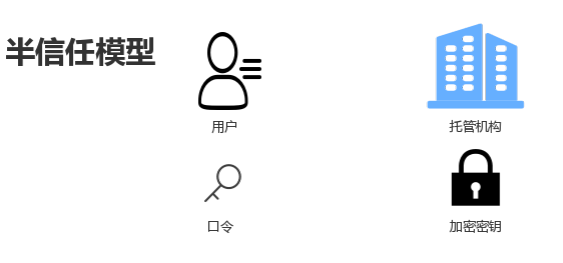
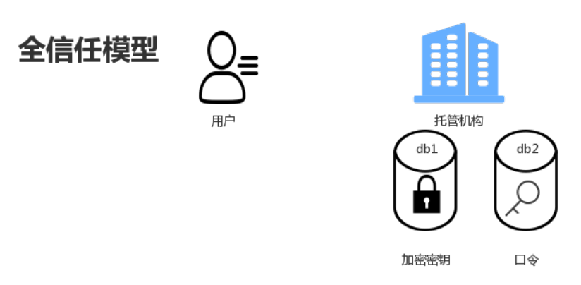

# 组件介绍

WeBankBlockchain-Governance-Key组件旨在让用户便捷、安全的使用私钥，其功能包含椭圆曲线私钥的生成、使用、多格式导出等功能，覆盖私钥全生命周期，并支持国密标准。Governance-Key包含key-toolkit和key-mgr两个组件，key-toolkit用于私钥的生成、加密、常规密码学操作，适合个人级用户使用。key-mgr用于私钥保管，适合企业级用户使用。

## 关键特性

### 多种密钥生成方式
提供三种密钥生成方式：随机数、助记词、密钥派生。随机数方式是指椭圆曲线方式，在曲线域内生成一个随机数作为私钥。助记词遵循BIP-32协议，通过助记词和口令可获取私钥，降低了私钥保存的难度。而密钥派生模式下，支持通过父级私钥和一串数据来确定性地生成下级私钥，适用于根据不同场景使用不同私钥的方案。

### 支持密钥导出
支持用户对私钥进行导出，目前支持PEM、PKCS12、Keystore等标准。PEM格式下，私钥信息被编码到.pem文件中；PKCS12格式下，私钥通过口令加密，按RFC7292规范导出到p12文件中，与openssl等主流工具相兼容；Keytstore格式下，私钥通过口令加密，按以太坊标准keystore格式导出到json文件中，兼容Metamask等钱包工具。

### 密钥托管方案
支持企业机构来托管用户私钥，适用于B2B2C等业务模式。该模式下，用户需要对该机构具有一定信任，目前支持半信任模型和全信任模型，企业机构可根据实际的信任度选择一种方案。

在半信任模型下，用户不会将私钥全部信息交给服务端，服务端仅保存加密后的私钥，而不保存解密口令，口令由用户自行保存。该模式下，用户需要记住自己的口令才能使用私钥，但安全性较高，即使服务端被黑客攻击，由于没有用户口令，攻击者也无法得到私钥明文。可以使用文件托管或数据库托管。

在全信任模型下，用户完全信任中心化机构，服务端既保存加密私钥，也保存解密口令。在该模式下，用户无需记忆任何信息，就可以从机构取得自己的私钥，但是如果攻击者同时盗取了加密私钥和解密口令，私钥就会泄露。为了给攻击者增加破解难度，我们采用了双库容灾模型，加密密文和解密口令分别由两个数据库保存，这样攻击者必须要攻破两个数据库才能成功实施攻击。

### 私钥分片、还原
支持将私钥进行门限分片和还原。使用者可以将私钥分解成n个碎片，只有集齐指定数量的碎片，才能恢复出原始私钥。

### 常规密码学操作
支持常规密码学操作，例如签名、加解密、哈希。

### 国密支持
支持国密算法。例如，对于私钥生成、签名、加解密等非对称密码学操作，我们采用标准国密曲线sm2p256v1；对于哈希，则采用SM3标准。

## 场景示例

### 个人使用场景示例
某用户想使用私钥来处理不同的业务需求，出于安全性考虑，该用户希望有一个根私钥，然后在不同的场景下使用其派生的子私钥。首先该用户使用助记词方式生成了一个私钥作为根私钥，将该助记词抄写在纸上妥善保管。随后，为了私钥明文在不被黑客攻击，该用户还用自己的口令将其加密为P12格式保存好。最后，该用户还是担心该私钥泄露，便采用门限分片将其分解为多片，置于不同的设备上，如果丢失，可以通过这些设备还原。

经过如此处理后，该用户认为根私钥已得到足够的保护。于是，对于不同的业务场景，该用户派生不同的子私钥来进行签名等操作。

### 企业使用场景示例
某app希望合规地使用用户数据，于是每次需要请求用户授权，若用户同意授权，则企业希望用户向区块链上发起一笔确认交易，为授权增信。但是，若用户不愿意自行保存私钥，于是该企业只得在后台中为用户生成私钥。该企业的用户中有相当一部分用户希望私钥不被泄露，而另一部分用户则完全不关心这些。于是，该企业部署两套私钥托管系统，分别服务两类用户。对于前者，采用半信仁模型，即只保存用户私钥密文，密码由用户自己持有；对于后者，采用全信任模型，保存用户密文和密码。出于安全性考虑，该企业将私钥密文和密码分别保存在两个机房中。

之后，如果用户同意签名，那么对于第一类用户，需要其提供密码先对密文解密，再执行签名；对于第二类用户，则直接解密并签名即可。
