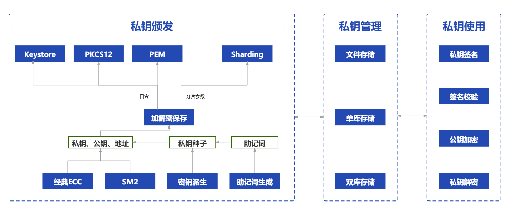
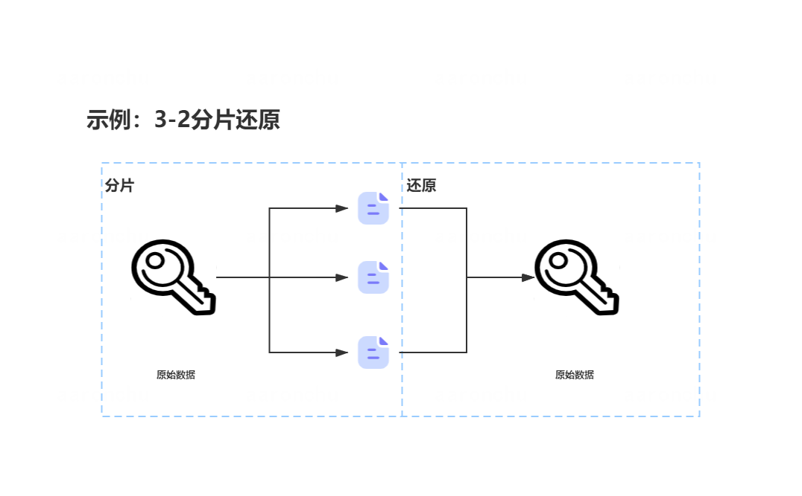
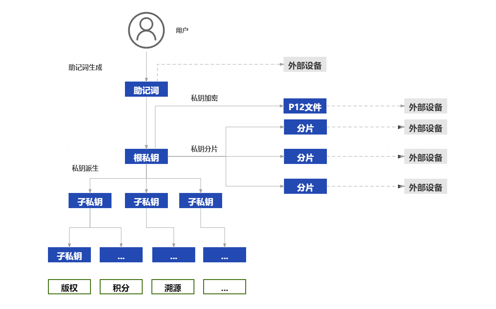

# 组件介绍

WeBankBlockchain-Governance-Key组件旨在让用户便捷、安全的使用私钥，其功能覆盖私钥颁发、私钥托管、私钥使用等功能，覆盖私钥全生命周期，并支持国密标准。Governance-Key包含key-core和key-mgr两个组件，key-toolkit用于私钥的生成、加密、常规密码学操作，支持多种主流协议。key-mgr用于私钥托管，包含多种托管模式。

## 关键特性

### 多种密钥生成方式
提供三种密钥生成方式：随机数、助记词、密钥派生。随机数方式是指椭圆曲线方式，在曲线域内生成一个随机数作为私钥。助记词遵循BIP-32协议，通过助记词和口令可获取私钥，降低了私钥保存的难度。而密钥派生模式下，支持通过父级私钥和一串数据来确定性地生成下级私钥，适用于根据不同场景使用不同私钥的方案。

### 支持密钥导出
支持用户对私钥进行导出，目前支持PEM、PKCS12、ETH Keystore等标准。PEM格式下，私钥信息被编码到.pem文件中；PKCS12格式下，私钥通过口令加密，按RFC7292规范导出到p12文件中，与openssl等主流工具相兼容；ETH Keystore格式下，私钥通过口令加密，按以太坊标准keystore格式导出到json文件中。

### 密钥托管方案
支持企业机构来托管用户私钥，适用于B2B2C等业务模式。该模式下，允许将用户的私钥加密并保存，其中加密后的密钥可保存到文件，也可以保存到数据库。此外，加密口令也可以单独保存到另一个数据库，通过双库的方式提高了安全性。

### 私钥分片、还原
支持将私钥进行门限分片和还原。使用者可以将私钥分解成n个碎片，只有集齐指定数量的碎片，才能恢复出原始私钥。

### 常规密码学操作
支持常规密码学操作，例如签名、加解密、哈希。

### 国密支持
支持国密算法。例如，对于私钥生成、签名、加解密等非对称密码学操作，我们采用标准国密曲线sm2p256v1；对于哈希，则采用SM3标准。

## 场景示例

### 个人使用场景示例
某用户想使用私钥来处理不同的业务需求，出于安全性考虑，该用户希望有一个根私钥，然后在不同的场景下使用其派生的子私钥。首先该用户使用助记词方式生成了一个私钥作为根私钥，将该助记词抄写在纸上妥善保管。随后，为了私钥明文在不被黑客攻击，该用户还用自己的口令将其加密为P12格式保存好。最后，该用户还是担心该私钥泄露，便采用门限分片将其分解为多片，置于不同的设备上，如果丢失，可以通过这些设备还原。

经过如此处理后，该用户认为根私钥已得到足够的保护。于是，对于不同的业务场景，该用户派生不同的子私钥来进行签名等操作。

